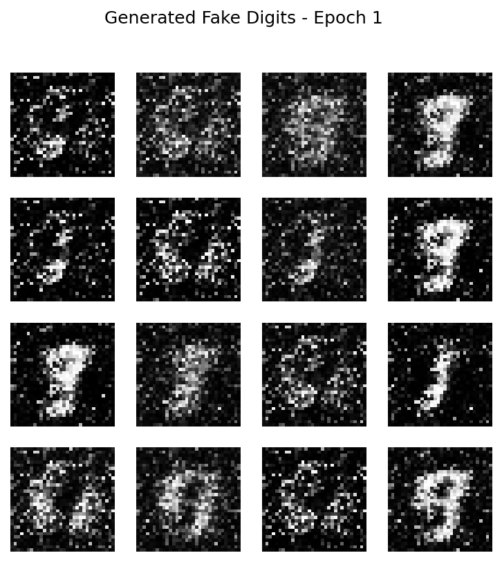
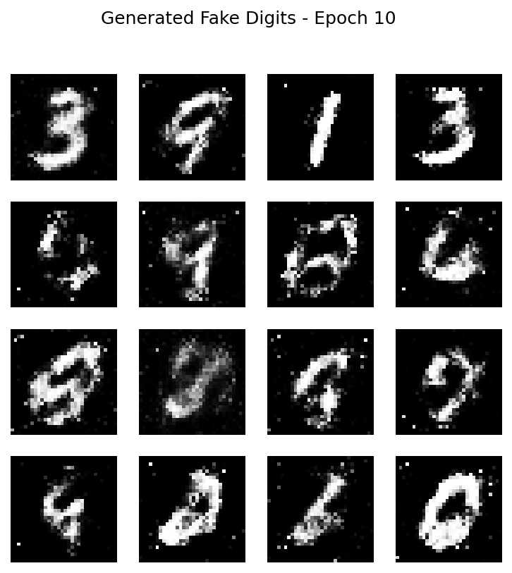
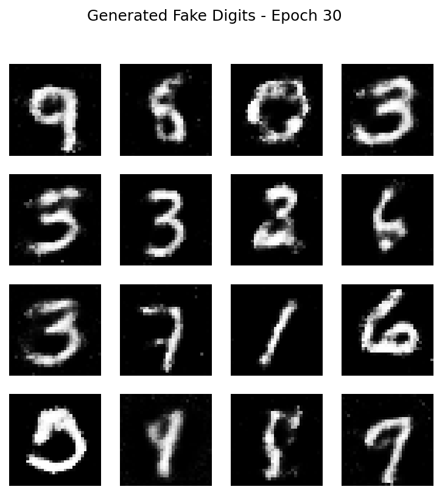

# GAN 生成手写数字 - 我的第一个AI项目

用 PyTorch 从零实现 GAN（生成对抗网络），从随机噪声生成逼真的手写数字（MNIST 数据集）。

**自学AI，不需要大学文凭！**  
我高中辍学后，通过AI导师一步步学习，亲手跑通了这个项目。行动比背景重要！

## 项目亮点
- 从纯噪声开始，训练50轮后，生成器能创建清晰可辨认的手写数字（1、5、7、4、9、3、6、8 等）
- 看到AI“学会写字”的完整过程，超级有成就感！
- 代码简单易懂，适合新手学习GAN原理

## 生成效果对比（50轮训练结果）

| Epoch 1（纯噪声） | Epoch 10（开始成型） | Epoch 30（越来越清晰） | Epoch 50（最终效果） |
|-------------------|----------------------|-------------------------|----------------------|
|  |  |  |  |

更多每轮图片都在 [results 文件夹](results/) 里，一张一张看进步过程超震撼！

## 如何运行（超级简单）
1. 安装依赖：
