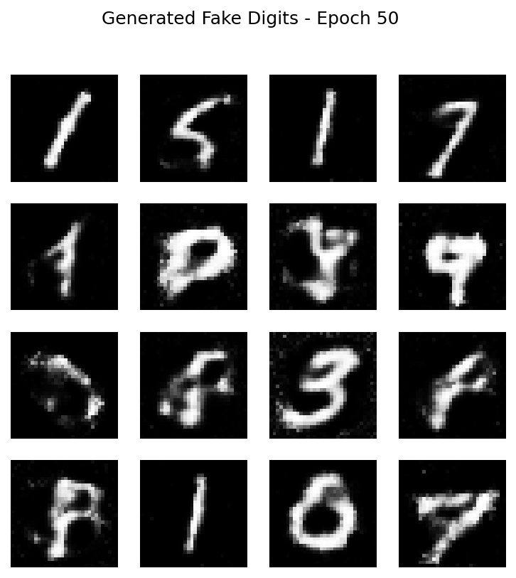

# gan-mnist-generator
My first AI project: GAN generating handwritten digits
# GAN 生成手写数字 - 我的第一个AI项目

用PyTorch从零实现GAN，从随机噪声生成手写数字（MNIST数据集）。

## 项目亮点
- 训练50轮后，生成器能创建清晰可辨认的手写数字
- 从纯噪声开始，一步步看到AI“学会”写字的过程

## 生成效果对比

(更多图片在 results 文件夹)

## 如何运行
1. 安装依赖：`pip install torch torchvision matplotlib`
2. 运行代码：`python gan_demo.py`
3. 结果保存在 results/ 文件夹

自学AI，不需要大学文凭！行动比背景重要。
